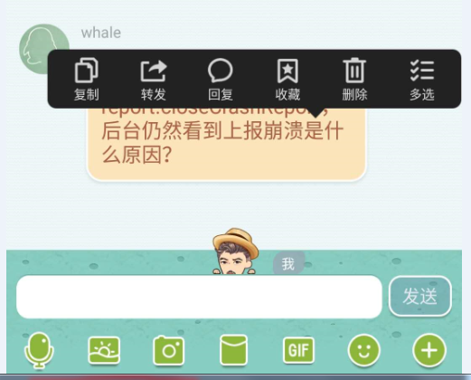
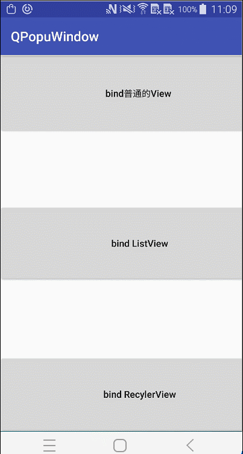

# 仿qq聊天消息长按弹窗


> 如图1是qq聊天消息的长按的弹窗,最主要的特点是有一个指针,指针的位置是手指触摸手机屏幕的位置,而且弹窗会根据手指的触摸屏幕的不同位置显示在不同的位置,图2是demo中的效果图


**图1**




**图2**



# QPopuWindow

> QPopuWindow继承自PopuWindow,支持所有的View及属性自定义扩展,通过builder链式调用来设置不同的属性和显示,使用简单,代码简洁.

## 如何使用

- **step**

1.在项目的根`build.gradle`添加

```bash
allprojects {
		repositories {
			...
			maven { url 'https://jitpack.io' }
		}
	}
```
2.在模块中添加依赖

```java
dependencies {
	        compile 'com.github.AndyAls:QPopuWindow:v1.0.0'
	}
```

3.使用

```java
listView.setOnItemLongClickListener(new AdapterView.OnItemLongClickListener() {
            @Override
            public boolean onItemLongClick(AdapterView<?> parent, View view, int position, long id) {

                QPopuWindow.getInstance(ListViewActivity.this).builder
                        .bindView(view, position)
                        .setPopupItemList(new String[]{"复制", "粘贴", "转发", "更多...."})
                        .setPointers(rawX, rawY)
                        .setOnPopuListItemClickListener(new QPopuWindow.OnPopuListItemClickListener() {
                            /**
                             * @param anchorView 为pop的绑定view
                             * @param anchorViewPosition  pop绑定view在ListView的position
                             * @param position  pop点击item的position 第一个位置索引为0
                             */
                            @Override
                            public void onPopuListItemClick(View anchorView, int anchorViewPosition, int position) {
                                Toast.makeText(ListViewActivity.this, anchorViewPosition + "---->" + position, Toast.LENGTH_SHORT).show();
                            }
                        }).show();
                return true;
            }
        });
```

# [点击查看源码详解和更多使用介绍](http://blog.csdn.net/andy_l1/article/details/79610003)

# Thanks
[PopupList](https://github.com/shangmingchao/PopupList)


